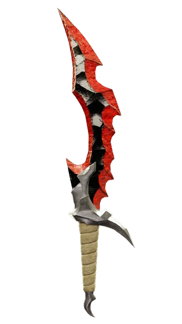

# Solo Leveling Landing Page
Welcome to the Fan Made website for Solo Leveling, a web novel that takes you on an extraordinary journey through the world of Sung Jin Woo and his incredible adventures. Dive into the characters, witness epic battles, and explore the shadows of Sung Jin Woo's realm.

## Table of Contents
1. [Introduction](#introduction)
2. [Features](#features)
3. [Installation / Fork](#installation--fork)
4. [Star the GitHub Repo](#star-the-github-repo)
5. [Code of the Website](#code-of-the-website)

---

## Introduction

Explore the captivating world of Solo Leveling through this interactive website. Immerse yourself in the story, characters, and thrilling battles that make this web novel a fan favorite.


<a target="_blank" href="https://ramxcodes.github.io/solo-leveling/" target="_blank" style="display: inline-block; padding: 10px 20px; background-color: #3498db; color: #fff; text-decoration: none; border-radius: 5px; font-weight: bold; font-size: 16px; margin-bottom: 20px;">Visit Website ↗</a>

---

## Features

- **Navigation Menu:**
  - Easy-to-use navigation menu with quick access to different sections.
  - Weekly updates, best manga, anime news, and more.

- **Content Display:**
  - Display of popular anime titles with corresponding images.
  - Each title is presented in a visually appealing format.

- **Responsive Design:**
  - The website is designed to be responsive, providing a seamless experience across different devices.

---

## Installation / Fork

To set up the Anime Hunt website locally or fork it for your own modifications, follow these steps:

1. Clone the repository:
    ```bash
    git clone https://github.com/ramxcodes/anime-hunt.git
    ```

2. Open the `index.html` file in a web browser to view the website locally.

3. Customize the content, styles, or scripts according to your preferences.

4. Make sure to update the repository URL in the cloned version:
    ```bash
    git remote set-url origin https://github.com/ramxcodes/anime-hunt.git
    ```

5. Push the changes to your GitHub repository:
    ```bash
    git push origin master
    ```

---

## God Fight
Witness the intense battle between Sung Jin Woo and a divine entity in the "God Fight" section. Experience the clash of supernatural powers and narrative tension that defines this epic confrontation.

## Shadows of Sung Jin Woo
Delve into the shadows of Sung Jin Woo's army, featuring key characters like Bellion, Beru, Igris, Kamish, and Greed. Learn about their strengths, roles, and significance in the unfolding storyline.

## Powerful Abilities
Uncover the extraordinary powers showcased in Solo Leveling, including speed, stealth, bloodlust, mana, and quicksilver. Explore how these abilities contribute to the characters' prowess in the world of Solo Leveling.

## Statue Of God
Discover the enigmatic "Statue Of God" and unravel its mysteries. Engage with captivating visuals and information about this intriguing element of the Solo Leveling narrative.

## Star the GitHub Repo

If you find the Anime Hunt website interesting or useful, consider starring the GitHub repository. Your support is highly appreciated!

---

## Code of the Website

Below is the HTML and CSS code that constitutes the Anime Hunt website. Feel free to explore and modify the code as needed.

### HTML (index.html)

```html
<!DOCTYPE html>
<html lang="en">
<head>
    <meta charset="UTF-8">
    <meta name="viewport" content="width=device-width, initial-scale=1.0">
    <link rel="preconnect" href="https://fonts.googleapis.com">
    <link rel="preconnect" href="https://fonts.gstatic.com" crossorigin>
    <link href="https://fonts.googleapis.com/css2?family=Montserrat:ital,wght@0,100..900;1,100..900&display=swap" rel="stylesheet">
    <link href="https://cdn.jsdelivr.net/npm/remixicon@4.2.0/fonts/remixicon.css" rel="stylesheet" />
    <link rel="stylesheet" href="style.css">
    <link rel="icon" type="image/x-icon" href="./Assets/dagger.png">
    <title>Solo Leveling</title>
</head>
<body>
    <div id="main">
        <div id="nav">
            <h1>Solo Leveling</h1>
            <h2><a href="#scroll">Characters</a></h2>
            <h2><a href="#page2">God Fight</a></h2>
            <h2><a href="#page3">SHADOW'S OF SUNG JIN WOO</a></h2>
            <!-- <h2><i class="ri-search-line"></i></h2> -->
            <a href="#marque"></a>
            <h3><i class="ri-menu-fold-2-line"></i></h3>
        </div>
        <div id="center">
            <div id="content">
                <video autoplay muted loop src="./Assets/main vid.mp4"></video>
                <div id="overlay">
                    <div id="over1">
                        <h1>Sung Jin woo</h1>
                        <h2>Level 100</h2>

                    </div>
                    <div id="over2">
                        <h4>Powers</h4>
                        <div id="img-wrap">
                            
                            
                            
                    </div>
                        
                    </div>

                </div>
            </div>
        </div>
        <div id="scroll">
            <div id="container">
                
                
                
                
                
                
                
            </div>
            <div id="container">
                
                
                
                
                
                
                
            </div>
        </div>
        <div id="alphabet">
            <h5>Powers</h5>
            <h6>Speed</h6>
            <h6>Stealth</h6>
            <h6>Bloodlust</h6>
            <h6>mana</h6>
            <h6>Quicksilver</h6>
        </div>
        <div id="page2">
            <div id="page2-part1">
                
                <h5>Statue Of God</h5>
            </div>
            <div id="page2-part2">
                
                <div id="solo">
                    <h5>Sung Jin Woo VS God</h5>
                <p>Sung Jin Woo, a formidable protagonist in the <b>"Solo Leveling"</b>  web novel, faces a transcendent challenge against a divine entity. 
                    Their epic clash unfolds in a breathtaking confrontation, blending supernatural prowess and intense narrative tension.</p>
                </div>
            </div>
        </div>
        <div id="page3">
            <h1>SHADOW's Of Sung Jin woo</h1>
            <div class="elem">
                <h4>01</h4>
                
                <div class="elem-part2">
                    <h1>Bellion</h1>
                    <h5>the Strongest Shadow in Jinwoo's Army</h5>
                </div>
            </div>
            <div class="elem">
                <h4>02</h4>
                
                <div class="elem-part2">
                    <h1>Beru</h1>
                    <h5>Sung Jinwoo's Right-hand Man</h5>
                </div>
            </div>
            <div class="elem">
                <h4>03</h4>
                
                <div class="elem-part2">
                    <h1>Igris</h1>
                    <h5>Shadow Monarch's Army Commander</h5>
                </div>
            </div>
            <div class="elem">
                <h4>04</h4>
                
                <div class="elem-part2">
                    <h1>Kamish</h1>
                    <h5>Humanity's Greatest Calamity</h5>
                </div>
            </div>
            <div class="elem">
                <h4>05</h4>
                
                <div class="elem-part2">
                    <h1>Greed</h1>
                    <h5>Shadow Monarch's Army General</h5>
                </div>
            </div>
        </div>
        <div id="marque">
            <h1>Solo Leveling</h1>
            <h1>Solo Leveling</h1>
            <h1>Solo Leveling</h1>
            <h1>Solo Leveling</h1>
            <h1>Solo Leveling</h1>
        </div>
        <div id="footer">
            <h5>Made With ❤️ <a target="_blank" href="https://github.com/ramxcodes">Ram ↗</a></h5>
        </div>
    </div>
</body>
</html>
```

### CSS (style.css)

```css
@font-face {
    font-family: 'Monument';
    src: url(./font/MonumentExtended-Regular.otf);
    font-weight: normal;
}

@font-face {
    font-family: 'Monument';
    src: url(./font/MonumentExtended-Ultrabold.otf);
    font-weight: bolder;
}

* {
    margin: 0;
    padding: 0;
    box-sizing: border-box;
    font-family: 'Montserrat';
}

html, body {
    height: 100%;
    width: 100%;
}

html {
    scroll-behavior: smooth;
}

body {
    background-color: #f8f8f8;
    user-select: none;
}

body::-webkit-scrollbar {
    width: 2px;          
}

body::-webkit-scrollbar-track {
    background: rgb(104, 141, 241);
}

body::-webkit-scrollbar-thumb {
    background-color: rgb(255, 204, 34);    
    border-radius: 50%;       
    border: 3px solid rgb(247, 210, 141);  
  }

#main {
    height: 100%;
    width: 100%;
    background-color: #f8f8f8;
    position: relative;
    padding-top: 0.1px;
}

#nav {
    height: 11vh;
    width: 100%;
    margin-top: 40px;
    border-top: 2px solid #000;
    border-bottom: 2px solid #000;
    display: flex;
    align-items: center;
    justify-content: space-between;
}

#nav img {
    height: 10vh;
    width: fit-content;
    padding: 0.1;
    object-fit: cover;
}

#nav h1 {
    height: 100%;
    width: 20%;
    display: flex;
    align-items: center;
    justify-content: center;
    font-family: 'monument';
    font-size: 38px;
    letter-spacing: -1px;
    position: relative;
}

#nav h1::after {
    content: "©️";
    font-family: montserrat;
    font-weight: 400;
    font-size: 20px;
    position: absolute;
    top: 18%;
    right: 3%;
}

#nav h1::before {
    content: "Made by ram";
    font-family: montserrat;
    font-weight: 400;
    font-size: 18px;
    position: absolute;
    bottom: 15%;
    right: 16%;
    letter-spacing: 1px;
    color: #666;
}

#nav h2 {
    height: 100%;
    width: 25%;
    display: flex;
    align-items: center;
    justify-content: center;
    border-right: 2px solid #000;
    font-size: 26px;
    font-weight: 600;
}

#nav a {
    text-decoration: none;
    color: black;
}

#nav h2:nth-last-child(2) {
    width: 30%;
}

#nav h2:nth-last-child(1) {
    width: 10%;
}

#nav h3 {
    display: none;
}

#center {
    height: 90%;
    width: 100%;
    position: relative;
    padding: 3vw 4vw;
}

#content {
    height: 100%;
    width: 100%;
    position: relative;
}

#content video {
    height: 100%;
    width: 100%;
    object-fit: cover;
}

#overlay {
    height: 50%;
    width: 100%;
    position: absolute;
    bottom: 0;
    padding: 3vw;
}

#over1 {
    display: flex;
    align-items: center;
    justify-content: space-between;
    color: #fff;
    margin-bottom: 2vh;
}

#over1 h1 {
    font-family: 'monument';
    font-size: 3vw;
}

#over1 h2 {
    font-size: 1vw;
    padding: 3vw 2.5vh;
    border-radius: 50%;
    border: 1px solid #fff;
}

#over2 {
    display: flex;
    align-items: center;
    justify-content: space-between;
    color: #fff;
    border-top: 2px solid #fff;
    padding: 2vw 0;
}

#over2 h4 {
    font-size: 1.3vw;
    font-weight: 500;
}

#over2 img {
    height: 3vw;
    gap: 1vw;
}

#img-wrap {
    display: flex;
    align-items: center;
    gap: 10px;
}

#scroll {
    height: 40vh;
    width: 100%;
    white-space: nowrap;
    overflow-x: hidden;
    overflow-y: hidden;
}

#container {
    height: 100%;
    width: 130%;
    display: inline-block;
    padding: 2vw;
    animation-name: anime;
    animation-duration: 10s;
    animation-iteration-count: infinite;
    animation-timing-function: linear;
}

#scroll img {
    height: 95%;
    border-radius: 50%;
    margin: 1vw;
    width: 13%;
    object-fit: cover;
    object-position: 30% 30%;
}

@keyframes anime {
    from {
        transform: translateX(0);
    }

    to {
        transform: translateX(-100%);
    }
}

#alphabet {
    height: 12vh;
    width: 100%;
    display: flex;
    align-items: center;
    justify-content: center;
    gap: 1vw;
    border-top: 2px solid #000;
    border-bottom: 2px solid #000;
}

#alphabet h5 {
    font-size: 2vw;
    text-transform: uppercase;
    font-weight: 400;
    font-style: italic;
    letter-spacing: 4px;
    border-bottom: 2px solid #000;
    margin-right: 2vw;
}

#alphabet h6 {
    font-size: 0.8vw;
    text-transform: uppercase;
    font-weight: 400;
    font-style: italic;
    letter-spacing: 4px;
    padding: 1.6vw 1vw;
    border-radius: 50%;
    cursor: pointer;
    border: 1px solid rgba(0, 0, 0, 0);
    transition: all ease 0.2s;
}

#alphabet h6:hover {
    border: 1px solid hsl(0, 0%, 0%);
}

#page2 {
    height: 100%;
    width: 100%;
    display: flex;
    align-items: center;
    justify-content: space-between;
    padding: 2.5vw 5vw;
}

#page2-part1 {
    height: 100%;
    width: 50%;
}

#page2-part1 img {
    height: 90%;
    width: 100%;
    object-fit: cover;
}

#page2-part1 h5 {
    margin-top: 0.3vw;
    color: rgb(22, 22, 22);
    font-size: 2.1vw;
    font-family: 'monument';
    font-weight: bolder;
}

#page2-part2 {
    height: 100%;
    width: 46%;
}

#page2-part2 img {
    height: 70%;
    width: 100%;
    object-fit: cover;
    object-position: center;
}

#page2-part2 h5 {
    width: 60%;
    font-size: 2.5vw;
    font-family: 'Monument';
    text-align: center;
}

#page2-part2 p {
    width: 40%;
    margin-top: 1vw;
}

#solo {
    display: flex;
    align-items: center;
    justify-content: space-between;
    padding-top: 2vw;
}

#page3 {
    height: 100%;
    width: 100%;
    position: relative;
    padding: 5vw 4vw;
}

#page3 > h1 {
    text-align: center;
    font-family: 'monument';
    text-transform: uppercase;
    font-size: 3vw;
    margin-bottom: 7vh;
}

.elem {
    height: 15vh;
    width: 100%;
    border-top: 2px solid #000;
    display: flex;
    align-items: center;
    justify-content: space-between;
    padding: 0 2vw;
    position: relative;
}

.elem img {
    height: 120px;
    width: 120px;
    position: absolute;
    border-radius: 50%;
    object-fit: cover;
    left: 12%;
    opacity: 0;
    transition: all ease 0.7s;
}

.elem:nth-last-child(1) img {
    left: 40%;
}

.elem:nth-last-child(3) img {
    left: 40%;
}

.elem:nth-last-child(5) img {
    left: 40%;
}

.elem:hover img {
    opacity: 1;
    left: 24%;
}

.elem h4 {
    font-size: 1.5vw;
    font-weight: 500;
    width: 6%;
    text-transform: uppercase;
}

.elem .elem-part2 {
    width: 45%;
}

.elem-part2 h1 {
    font-size: 2.4vw;
    font-weight: 600;
}

.elem-part2 h5 {
    font-size: 0.7vw;
    font-weight: 500;
    text-transform: uppercase;
}

.elem:nth-last-child(1) {
    border-bottom: 2px solid #000;
}

#marque {
    width: 100%;
    white-space: nowrap;
    padding: 0.8vw;
    overflow-x: hidden;
    overflow-y: hidden;
    border-top: 2px solid #000;
    border-bottom: 2px solid #000;
    margin-top: 3vw;
}

#marque h1 {
    display: inline-block;
    font-size: 3vw;
    text-transform: uppercase;
    font-weight: 900;
    -webkit-text-stroke: 2px black;
    color: transparent;
    font: 'monument';
    letter-spacing: 3px;
    margin-right: 16px;
    animation-name: move;
    animation-duration: 2s;
    animation-iteration-count: infinite;
    animation-timing-function: linear;
}

@keyframes move {
    from {
        transform: translateX(0);
    }

    to {
        transform: translateX(calc(-100% - 20px));
    }
}

#footer {
    height: fit-content;
    width: 100%;
    padding: 2vw;
    text-align: center;
}

#footer h5 {
    font-size: 1vw;
}

#footer a {
    text-decoration: none;
    color: #000;
}

@media (max-width: 600px) {
    body {
        overflow-x: hidden;
        user-select: none;
    }

    #nav {
        height: 8vh;
        margin-top: 20px;
        padding: 0vw 5vw;
    }

    #nav img {
        height: 10vh;
        width: fit-content;
        padding: 0.1;
        object-fit: cover;
    }

    #nav h1 {
        width: 40%;
        justify-content: flex-start;
        font-size: 14px;
    }

    #nav h1::after,
    #nav h1::before {
        display: none;
    }

    #nav h2,
    #nav a {
        display: none;
    }

    #nav h3 {
        display: block;
    }

    #center {
        height: 30%;
        padding: 3vw 4vw;
    }

    #content {
        height: 100%;
        width: 100%;
        position: relative;
    }

    #content video {
        height: 100%;
        width: 100%;
        object-fit: cover;
    }

    #overlay {
        height: fit-content;
        padding: 3vw;
    }

    #over1 h1 {
        margin-top: 1vw;
        font-size: 5vw;
    }

    #over1 h2 {
        font-size: 1.5vw;
        padding: 5vw 1.5vh;
    }

    #over2 {
        display: flex;
        align-items: center;
        justify-content: space-between;
        color: #fff;
        border-top: 2px solid #fff;
        padding: 2vw 0;
    }

    #over2 h4 {
        font-size: 2.3vw;
        font-weight: 500;
    }

    #over2 img {
        height: 5vw;
        gap: 1vw;
    }

    #img-wrap {
        display: flex;
        align-items: center;
        gap: 10px;
    }

    #scroll {
        height: 16vh;
        width: 100%;
        white-space: nowrap;
        overflow-x: hidden;
        overflow-y: hidden;
    }

    #container {
        height: 100%;
        width: 230%;
        display: inline-block;
        padding: 2vw;
        animation-name: anime;
        animation-duration: 10s;
        animation-iteration-count: infinite;
        animation-timing-function: linear;
    }

    #scroll img {
        height: 95%;
        border-radius: 50%;
        margin: 1vw;
        width: 13.5%;
        object-fit: cover;
        object-position: top;
    }

    #alphabet {
        height: 10vh;
        width: 100%;
        display: flex;
        align-items: center;
        justify-content: center;
        gap: 0.6vw;
        border-top: 2px solid #000;
        border-bottom: 2px solid #000;
    }

    #alphabet h5 {
        font-size: 3vw;
        text-transform: uppercase;
        font-weight: 400;
        font-style: italic;
        letter-spacing: 4px;
        border-bottom: 2px solid #000;
        margin-right: 2vw;
    }

    #alphabet h6 {
        font-size: 2vw;
        text-transform: uppercase;
        font-weight: 400;
        font-style: italic;
        letter-spacing: 4px;
        padding: 1.6vw 1vw;
        border-radius: 50%;
        cursor: pointer;
        border: 1px solid rgba(0, 0, 0, 0);
        transition: all ease 0.2s;
    }

    #alphabet h6:hover {
        border: 1px solid hsl(0, 0%, 0%);
    }

    #alphabet h6:nth-last-child(1) {
        display: none;
    }

    #page2 {
        height: 100%;
        width: 100%;
        display: flex;
        align-items: center;
        justify-content: space-between;
        flex-direction: column;
        padding: 2.5vw 5vw;
    }

    #page2-part1 {
        height: 100%;
        width: 100%;
    }

    #page2-part1 img {
        height: 90%;
        width: 100%;
        object-fit: cover;
    }

    #page2-part1 h5 {
        margin-top: 0.3vw;
        color: rgb(22, 22, 22);
        font-size: 5.1vw;
        font-family: 'monument';
        font-weight: bolder;
        text-align: center;
    }

    #page2-part2 {
        margin-top: 2vw;
        height: 100%;
        width: fit-content;
    }

    #page2-part2 img {
        height: 70%;
        width: 100%;
        object-fit: cover;
        object-position: center;
    }

    #page2-part2 h5 {
        width: 80%;
        font-size: 4.5vw;
        font-family: 'Monument';
        text-align: center;
    }

    #page2-part2 p {
        width: 90%;
        margin-top: 2vw;
    }

    #solo {
        display: flex;
        align-items: center;
        justify-content: space-between;
        padding-top: 3vw;
        flex-direction: column;
        gap: 3vw;
    }

    #page3 {
        height: 100%;
        width: 100%;
        position: relative;
        padding: 45vw 4vw 10vw 4vw;
    }

    #page3 > h1 {
        text-align: center;
        font-family: 'monument';
        text-transform: uppercase;
        font-size: 4.5vw;
        margin-bottom: 7vh;
    }

    .elem {
        height: 12vh;
        width: 100%;
        border-top: 2px solid #000;
        display: flex;
        align-items: center;
        justify-content: space-between;
        padding: 0 2vw;
        position: relative;
    }

    .elem img {
        height: 60px;
        width: 60px;
        position: absolute;
        border-radius: 50%;
        object-fit: cover;
        left: 12%;
        opacity: 0;
        transition: all ease 0.7s;
    }

    .elem h4 {
        font-size: 3vw;
    }

    .elem .elem-part2 {
        width: 45%;
    }

    .elem-part2 h1 {
        font-size: 5vw;
        font-weight: 600;
    }

    .elem-part2 h5 {
        font-size: 2vw;
        font-weight: 500;
        text-transform: uppercase;
    }

    .elem:nth-last-child(1) {
        border-bottom: 2px solid #000;
    }

    #marque {
        width: 100%;
        white-space: nowrap;
        padding: 8vw;
        overflow-x: hidden;
        overflow-y: hidden;
        border-top: 2px solid #000;
        border-bottom: 2px solid #000;
        margin-top: 3vw;
    }

    #marque h1 {
        font-size: 10vw;
    }

    @keyframes move {
        from {
            transform: translateX(0);
        }

        to {
            transform: translateX(calc(-100% - 20px));
        }
    }

    #footer {
        height: fit-content;
        width: 100%;
        padding: 5vw;
        text-align: center;
    }

    #footer a {
        text-decoration: none;
        color: #000;
    }
}
```

---

Feel free to explore and customize the code to suit your preferences.

Made with ❤️ by [Ram](https://github.com/ramxcodes).
